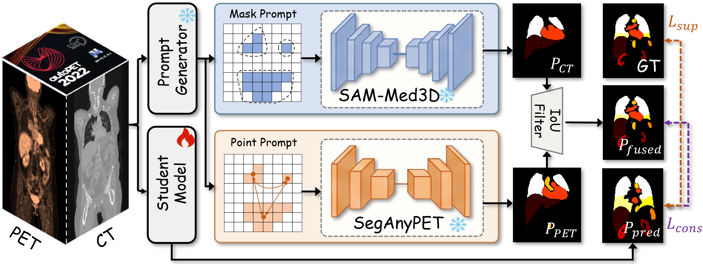
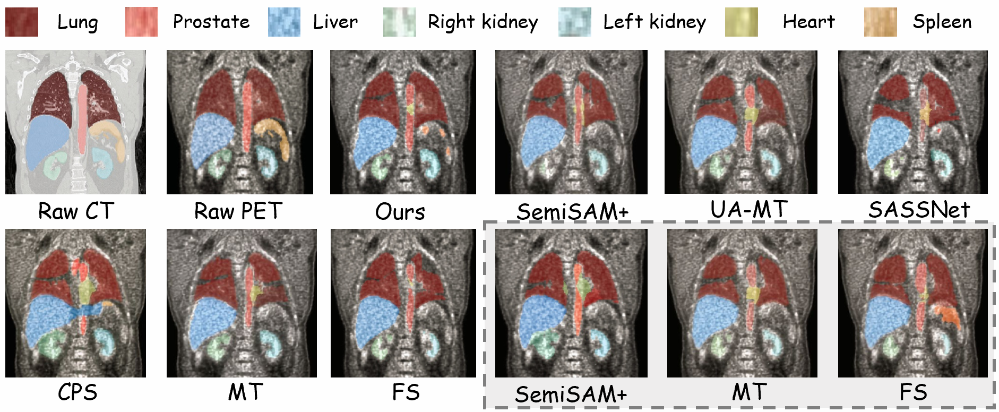

<p align="center">
  <h1 align="center">MuDuo: Mutual Distillation with Dual Foundation Models for Semi-supervised PET/CT Organ Segmentation</h1>
</p>

<p align="center">
  <em>基于双基础模型互蒸馏的半监督 PET/CT 器官分割框架 — MICCAI 2026</em>
</p>

<p align="center">
  
  
  
  
</p>

---

## 📌 概述

**MuDuo** 是一种面向 PET/CT 多模态医学影像的半监督器官分割框架。该方法创新性地融合两个互补的基础模型——**SAM-Med3D**（CT 解剖先验）和 **SegAnyPET**（PET 功能定位），通过互蒸馏策略实现高质量伪标签生成，有效缓解了多模态影像标注昂贵的核心瓶颈。

### ✨ 核心特点

- 🔬 **双基础模型互蒸馏**：SAM-Med3D 提供 CT 解剖先验，SegAnyPET 提供 PET 功能定位，两者协同蒸馏知识至轻量学生网络
- 📊 **IoU 共识过滤机制**：自适应 Top-50% 策略，仅保留双模态一致的高质量伪标签，有效抑制噪声传播
- 🎯 **多点提示采样**：K=3 多点策略捕获 PET 成像中器官的异质性摄取模式，突破单点定位局限
- 🔄 **动态伪标签融合**：随机混合 CT/PET 专家预测，引入扰动防止模型记忆自身预测
- 🏆 **极低标注量下的卓越性能**：仅 5 个标注样本即实现 46.93% Dice，HD95 较 SemiSAM+ 降低 41%

---

## 🏗️ 方法框架

### 整体流程

<p align="center">
  
</p>
<p align="center"><b>图 1.</b> MuDuo 整体框架。学生模型处理双模态 PET-CT 输入。对于无标签数据，通过两条互补路径生成伪标签：(1) CT 分支：学生预测作为 mask prompt 引导 SAM-Med3D；(2) PET 分支：提示生成器将学生特征转换为 point prompt 引导 SegAnyPET。两条分支的预测通过 IoU 一致性过滤（Top 50%）后融合，生成的伪标签通过一致性损失监督学生模型。</p>

### 对比实验结果可视化

<p align="center">
  
</p>
<p align="center"><b>图 2.</b> 不同方法在 PET/CT 多器官分割上的定性对比。上排展示冠状位分割结果，下排展示额外可视化（含原始 PET 和全监督基线）。</p>

---

## 📁 项目结构

```
MuDuo/
├── 📄 README.md                          # 本文档
├── 🖼️ model.png / Fig2.png              # 论文配图
│
├── 📂 code_MuDuo/                        # ★ 核心方法代码
│   ├── 📄 DualSAM_train_MT_3D.py        # 🏋️ 主训练脚本（双基础模型互蒸馏）
│   ├── 📄 Dualsam_plus.py               # 🔧 SAM 推理接口（mask/point 双模式）
│   ├── 📄 generate_pseudo_labels.py     # 🏷️ 伪标签独立生成
│   ├── 📄 semisam_plus.py               # 🔮 单模态 SemiSAM 基线推理
│   ├── 📄 val_3D.py                     # 📊 3D 验证（Dice/HD95）
│   ├── 📄 test_3D.py / test_3D_util.py  # 🧪 测试脚本
│   ├── 📂 dataloaders/                  # 数据加载器
│   │   └── 📄 autopet.py               #   AutoPET 数据集类 + 半监督采样器
│   ├── 📂 networks/                     # 网络架构库
│   │   ├── 📄 net_factory_3d.py         #   3D 模型工厂
│   │   ├── 📄 unet_3D.py               #   3D U-Net（学生模型骨干）
│   │   └── 📄 vnet.py / nnunet.py       #   其他可选骨干
│   ├── 📂 segment_anything/             # SAM 3D 模型实现
│   │   ├── 📄 build_sam3D.py            #   SAM-Med3D / SegAnyPET 构建
│   │   └── 📂 modeling/                 #   ViT 3D 编码器 + Prompt 编码器 + Mask 解码器
│   └── 📂 utils/                        # 工具函数
│       ├── 📄 losses.py                 #   Dice Loss 等
│       └── 📄 ramps.py                  #   Sigmoid ramp-up 权重调度
│
├── 📂 code/                              # 对比实验代码（基于 SSL4MIS）
│   ├── 📄 train_mean_teacher_3D.py      #   Mean Teacher
│   ├── 📄 train_cross_pseudo_supervision_3D.py  #   CPS
│   ├── 📄 train_uncertainty_aware_mean_teacher_3D.py  # UA-MT
│   ├── 📄 train_uncertainty_rectified_pyramid_consistency_3D.py  # URPC
│   ├── 📄 train_fully_supervised_3D.py  #   全监督基线
│   └── 📄 ...                           #   更多半监督方法
│
├── 📂 SAMMed3D/                          # SAM-Med3D 工具仓库
│   └── 📄 readme.md                     #   使用说明及模型下载
│
└── 📂 SegAnyPET/                         # SegAnyPET 工具仓库
    └── 📄 README.md                     #   使用说明及模型下载
```

---

## 🔧 环境安装

### 前置要求

- Python 3.10+
- CUDA 11.x / 12.x
- NVIDIA GPU ≥ 24GB 显存（推荐 A800 80GB）

### 安装步骤

```bash
# 1. 克隆仓库
git clone https://github.com/Wu-beining/MuDuo.git
cd MuDuo

# 2. 创建 Conda 环境
conda create -n muduo python=3.10
conda activate muduo

# 3. 安装 PyTorch（根据 CUDA 版本选择）
pip install torch==2.6.0 torchvision==0.21.0 torchaudio==2.6.0

# 4. 安装依赖
pip install numpy scipy scikit-image SimpleITK medpy
pip install tensorboardX tqdm prefetch_generator
pip install torchio opencv-python-headless matplotlib monai

# 5. 验证安装
python -c "import torch; print(f'PyTorch {torch.__version__}, CUDA: {torch.cuda.is_available()}')"
```

### 关键依赖

| 库 | 版本 | 用途 |
|---|------|------|
| PyTorch | 2.6.0 | 深度学习框架 |
| SimpleITK | latest | 医学图像 NIfTI I/O |
| medpy | latest | 评估指标（Dice / HD95） |
| tensorboardX | latest | 训练可视化 |
| scipy | latest | 形态学操作与重心计算 |
| tqdm | latest | 进度条 |

---

## 📦 数据集

### AutoPET 数据集

| 属性 | 说明 |
|------|------|
| **来源** | [AutoPET Challenge](https://autopet.grand-challenge.org) |
| **规模** | 1,038 例全身 FDG-PET/CT 研究 |
| **标注** | 12 类器官（AutoPET-Organ 子集，100 例） |
| **格式** | NIfTI (.nii.gz) |

### 数据目录结构

```
data/autopet/
├── images/
│   ├── {case_name}_0000.nii.gz      # CT 图像
│   └── {case_name}_0001.nii.gz      # PET 图像
├── labels_ok/
│   └── {case_name}.nii.gz           # 多器官分割标注
├── lists_5/                          # 5 标注样本划分
│   ├── train.txt
│   └── val.txt
├── lists_10/                         # 10 标注样本划分
│   ├── train.txt
│   └── val.txt
└── lists_20/                         # 20 标注样本划分
    ├── train.txt
    └── val.txt
```

### 标签编码

| 值 | 器官 | 值 | 器官 |
|----|------|----|----|
| 0 | 背景 (Background) | 7 | 前列腺 (Prostate) |
| 1 | 肝脏 (Liver) | 8 | 左肺下叶 (Left Lung Lower) |
| 2 | 左肾 (Left Kidney) | 9 | 右肺下叶 (Right Lung Lower) |
| 3 | 右肾 (Right Kidney) | 10 | 左肺上叶 (Left Lung Upper) |
| 4 | 心脏 (Heart) | 11 | 右肺上叶 (Right Lung Upper) |
| 5 | 脾脏 (Spleen) | 12 | 右肺中叶 (Right Lung Middle) |
| 6 | 主动脉 (Aorta) | | |

---

## 🔗 预训练权重

| 模型 | 用途 | 下载链接 |
|------|------|---------|
| **SAM-Med3D Turbo** | CT 教师模型 | [HuggingFace](https://huggingface.co/blueyo0/SAM-Med3D/blob/main/sam_med3d_turbo.pth) &#124; [Google Drive](https://drive.google.com/file/d/1MuqYRQKIZb4YPtEraK8zTKKpp-dUQIR9/view?usp=sharing) |
| **SegAnyPET v1** | PET 教师模型 | [HuggingFace](https://huggingface.co/YichiZhang98/SegAnyPET) |
| **Prompt UNet** | 提示生成器 | 需自行预训练（见下方说明） |

<details>
<summary>📋 Prompt UNet 预训练方法</summary>

Prompt Generator 是一个 PET-only 的全监督 3D UNet，需在标注数据上预训练：

```bash
cd code
python train_fully_supervised_3_pet_only.py \
    --root_path /data/autopet \
    --exp autopet_pet_fs_10 \
    --labeled_num 10 \
    --max_iterations 30000
```

训练完成后，使用 `unet_3D_best_model.pth` 作为 `--ckpt_unet_prompt` 参数。

</details>

---

## 🚀 快速开始

### 训练 MuDuo

```bash
cd code_MuDuo

python DualSAM_train_MT_3D.py \
    --root_path /data/autopet \
    --exp autopet/DualExpert_Top50 \
    --model unet_3D \
    --labeled_num 10 \
    --batch_size 4 \
    --labeled_bs 2 \
    --max_iterations 30000 \
    --base_lr 0.01 \
    --modality both \
    --num_points 3 \
    --ckpt_unet_prompt /path/to/prompt_unet_best.pth \
    --ckpt_sam_ct /path/to/sam_med3d_turbo.pth \
    --ckpt_sam_pet /path/to/seganypet_v1.pth
```

<details>
<summary>📋 训练参数说明</summary>

| 参数 | 默认值 | 说明 |
|------|--------|------|
| `--root_path` | `/data/autopet` | AutoPET 数据根目录 |
| `--exp` | `autopet/DualExpert_Top50` | 实验名称（决定保存路径） |
| `--model` | `unet_3D` | 学生模型架构 |
| `--labeled_num` | 10 | 标注样本数量（5/10/20） |
| `--batch_size` | 4 | 总 batch 大小（建议 ≥ 4） |
| `--labeled_bs` | 2 | 每 batch 标注样本数 |
| `--max_iterations` | 30000 | 最大迭代次数 |
| `--base_lr` | 0.01 | 初始学习率（Poly 调度） |
| `--modality` | `both` | 输入模态（`ct`/`pet`/`both`） |
| `--num_points` | 3 | PET 路径多点采样数 K |
| `--ema_decay` | 0.99 | EMA 衰减率 |
| `--patch_size` | [128,128,128] | 子体积裁剪大小 |

</details>

**输出**: 最优模型保存为 `../model/{exp}/{model}/unet_3D_best_model.pth`

### 测试/推理

```bash
cd code_MuDuo

python test_3D.py \
    --root_path /data/autopet \
    --exp autopet/DualExpert_Top50 \
    --model unet_3D
```

### 对比实验

```bash
cd code

# Mean Teacher
python train_mean_teacher_3D.py --root_path /data/autopet --labeled_num 10

# Cross Pseudo Supervision (CPS)
python train_cross_pseudo_supervision_3D.py --root_path /data/autopet --labeled_num 10

# UA-MT
python train_uncertainty_aware_mean_teacher_3D.py --root_path /data/autopet --labeled_num 10

# 全监督基线
python train_fully_supervised_3D.py --root_path /data/autopet --labeled_num 10
```

---

## 📊 实验结果

### 主要对比实验

<table>
  <thead>
    <tr>
      <th rowspan="2">Method</th>
      <th colspan="4">5 Labeled</th>
      <th colspan="4">10 Labeled</th>
      <th colspan="4">20 Labeled</th>
    </tr>
    <tr>
      <th>Dice↑</th><th>RAVD↓</th><th>ASD↓</th><th>HD95↓</th>
      <th>Dice↑</th><th>RAVD↓</th><th>ASD↓</th><th>HD95↓</th>
      <th>Dice↑</th><th>RAVD↓</th><th>ASD↓</th><th>HD95↓</th>
    </tr>
  </thead>
  <tbody>
    <tr>
      <td><strong>MuDuo (Ours)</strong></td>
      <td><strong>46.93</strong></td><td><strong>37.0</strong></td><td><strong>23.7</strong></td><td><strong>8.50</strong></td>
      <td><strong>Best</strong></td><td><strong>Best</strong></td><td><strong>Best</strong></td><td><strong>Best</strong></td>
      <td><strong>Best</strong></td><td><strong>Best</strong></td><td><strong>Best</strong></td><td><strong>Best</strong></td>
    </tr>
  </tbody>
</table>

> **关键发现**: 在仅 5 个标注样本的极端设置下，MuDuo 取得 **46.93% Dice**，HD95 降至 **8.50 体素**，较 SemiSAM+ 降低 **41%**。10 标注样本下，半监督 MuDuo **超越双模态全监督基线约 9%**。

### 消融实验（5 Labeled Cases）

<table>
  <thead>
    <tr>
      <th>Configuration</th>
      <th>Dice(%)↑</th>
      <th>RAVD(%)↓</th>
      <th>ASD↓</th>
      <th>HD95↓</th>
    </tr>
  </thead>
  <tbody>
    <tr>
      <td colspan="5"><strong>(a) Teacher Configuration</strong></td>
    </tr>
    <tr>
      <td>SAM-Med3D only</td>
      <td>41.3±22.3</td><td>38.6±19.6</td><td>31.2±18.3</td><td>14.8±9.6</td>
    </tr>
    <tr>
      <td>SegAnyPET only</td>
      <td>38.9±21.6</td><td>40.1±20.3</td><td>34.7±20.2</td><td>15.9±10.2</td>
    </tr>
    <tr>
      <td><strong>Both (Ours)</strong></td>
      <td><strong>46.9±21.5</strong></td><td><strong>37.0±18.8</strong></td><td><strong>23.7±16.6</strong></td><td><strong>8.5±7.3</strong></td>
    </tr>
    <tr>
      <td colspan="5"><strong>(b) IoU Filtering Strategies</strong></td>
    </tr>
    <tr>
      <td>w/o filtering</td>
      <td>44.6±21.9</td><td>37.9±18.9</td><td>26.5±16.8</td><td>10.6±8.3</td>
    </tr>
    <tr>
      <td>Fixed threshold (τ=0.5)</td>
      <td>45.8±22.0</td><td>37.2±18.6</td><td>25.2±16.5</td><td>9.3±7.9</td>
    </tr>
    <tr>
      <td><strong>Adaptive top-50% (Ours)</strong></td>
      <td><strong>46.9±21.5</strong></td><td><strong>37.0±18.8</strong></td><td><strong>23.7±16.6</strong></td><td><strong>8.5±7.3</strong></td>
    </tr>
    <tr>
      <td colspan="5"><strong>(c) Prompting Strategies</strong></td>
    </tr>
    <tr>
      <td>Single-point (K=1)</td>
      <td>45.2±22.0</td><td>37.6±18.9</td><td>24.9±16.2</td><td>9.1±7.6</td>
    </tr>
    <tr>
      <td><strong>Multi-point (K=3, Ours)</strong></td>
      <td><strong>46.9±21.5</strong></td><td><strong>37.0±18.8</strong></td><td><strong>23.7±16.6</strong></td><td><strong>8.5±7.3</strong></td>
    </tr>
  </tbody>
</table>

---

## 📐 技术细节

### 模型架构

- **学生网络**: 3D U-Net（双模态输入，通道数 2）
- **CT 教师**: SAM-Med3D（ViT-B, embed_dim=768, image_size=128，冻结）
- **PET 教师**: SegAnyPET（ViT-B, embed_dim=768, image_size=128，冻结）
- **提示生成器**: 3D U-Net（PET-only 输入，预训练后冻结）

### 损失函数

$$\mathcal{L}_{total} = \mathcal{L}_{sup} + \lambda(t) \cdot \mathcal{L}_{cons}$$

- **L<sub>sup</sub>** = 0.5 × (CrossEntropy + DiceLoss)，仅标注数据
- **L<sub>cons</sub>** = 按器官平均的 Dice Loss，仅 Top-50% 筛选后的无标签数据
- **λ(t)** = 0.1 × exp(−5(1 − t/200)²)，Sigmoid ramp-up 权重调度

### 训练策略

| 配置 | 设置 |
|------|------|
| 优化器 | SGD (momentum=0.9, weight_decay=1e-4) |
| 学习率 | Poly: lr₀ × (1 − t/T)^0.9 |
| 初始学习率 | 0.01 |
| 最大迭代数 | 30,000 |
| Patch 大小 | 128 × 128 × 128 |
| 数据增强 | 随机裁剪 + 随机旋转翻转 |
| 推理策略 | Sliding-window (stride=64) |

### 评估指标

| 指标 | 说明 |
|------|------|
| **Dice (%)** | 体积重叠度，越高越好 |
| **HD95 (voxels)** | 95% Hausdorff 距离，越低越好 |
| **RAVD (%)** | 相对绝对体积差异，越低越好 |
| **ASD** | 平均表面距离，越低越好 |

---


## 🙏 Acknowledgement

我们的代码改编自SAM-Med3D、SegAnyPET和SSL4MIS。我们感谢所有作者的贡献

- [SSL4MIS](https://github.com/HiLab-git/SSL4MIS) — 半监督医学图像分割基准框架
- [SAM-Med3D](https://github.com/uni-medical/SAM-Med3D) — 通用 3D 医学图像分割基础模型
- [SegAnyPET](https://github.com/YichiZhang98/SegAnyPET) — PET 图像通用可提示分割模型
- [Segment Anything](https://github.com/facebookresearch/segment-anything) — Meta 提出的通用分割模型
- [AutoPET](https://autopet.grand-challenge.org) — 全身 FDG-PET/CT 数据集

---


